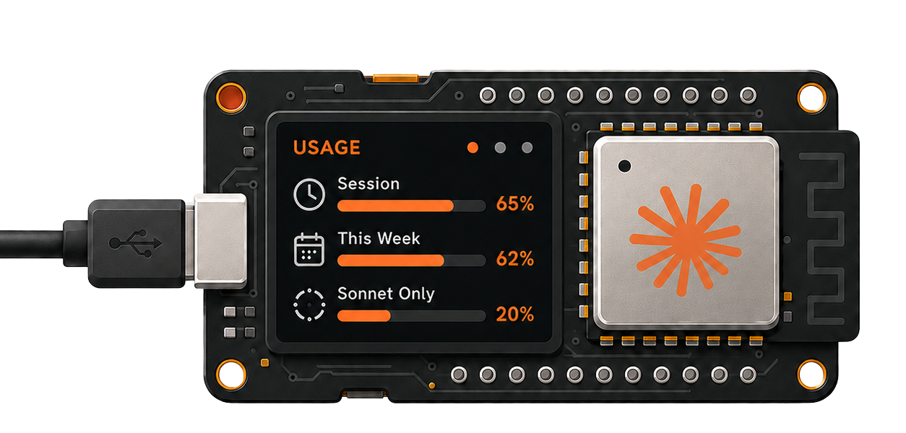

<p align="center">
  
</p>

<h1 align="center">AI Usage Monitor</h1>

<p align="center">Live AI agent usage — your rolling 5-hour and weekly rate-limit utilization, with reset countdowns, on a tiny ESP8266 OLED.</p>

<p align="center">
  <a href="https://github.com/hudsonbrendon/ai-usage-monitor/actions/workflows/tests.yml"></a>
  <a href="https://github.com/hudsonbrendon/ai-usage-monitor/releases"></a>
  <a href="LICENSE"></a>
  
</p>

A from-scratch firmware that polls an AI provider and shows your agent usage on a 0.96" OLED. Designed to be multi-provider: a `Provider` interface keeps the data source pluggable, and a `Canvas`/`IBoard` abstraction keeps every screen board-agnostic.

## Providers

| Provider | Status | Data source |
|----------|--------|-------------|
| Claude (Anthropic) | ✅ supported | `anthropic-ratelimit-unified-5h/7d-*` headers on the Messages API |
| Codex (OpenAI) | 🛠️ planned | `/backend-api/codex/usage` (5h + weekly windows) |

## Features

- Rolling 5-hour and weekly rate-limit utilization as on-screen bars, with reset countdowns.
- One-time setup over a captive Wi-Fi portal — no hardcoded credentials.
- Single-button UX: tap = screen on/off, long-press = refresh, hold 5 s = factory reset.
- Pluggable `Provider` and board-agnostic `Canvas`/`IBoard` design.
- Host-side unit tests for the pure logic (parsing, settings) via PlatformIO `native`.

## Hardware

- **ideaspark ESP8266** (ESP-12S) with an integrated **SSD1306 128x64 I2C OLED** (VR:2.1).
- OLED wired to **SDA = GPIO12, SCL = GPIO14**; the onboard **FLASH** button is on **GPIO0**.

## Build & flash (PlatformIO)

```bash
pio test -e native        # host unit tests
pio run  -e ideaspark     # build firmware
pio run  -e ideaspark -t upload
```

## Flash a release build (no toolchain)

Grab the latest `firmware.bin` from [Releases](https://github.com/hudsonbrendon/ai-usage-monitor/releases) and flash it at offset `0x0`:

```bash
esptool.py --chip esp8266 --baud 460800 write_flash \
  --flash_mode dio --flash_freq 40m --flash_size detect \
  0x0 ai-usage-monitor-ideaspark-vX.Y.Z.bin
```

## Setup

1. On first boot the device opens an open Wi-Fi AP `AIUsage-XXXX`.
2. Join it and open `http://192.168.4.1`.
3. Enter your 2.4 GHz Wi-Fi and a provider token (for Claude: `claude setup-token`).
4. It reboots and shows the dashboard.

## Adding a provider

Providers are additive — implement the `Provider` interface (`id()` + `fetch()`) in `src/providers/<name>.cpp`, then select it. No screen, board, or logic code changes.

## Adding a board

Boards are additive — see [`docs/EXTENDING.md`](docs/EXTENDING.md): drop a `src/boards/<name>.cpp` implementing `IBoard`, add a PlatformIO env, and (only for a new display technology) a `Canvas` subclass.

## License

MIT © Hudson Brendon
