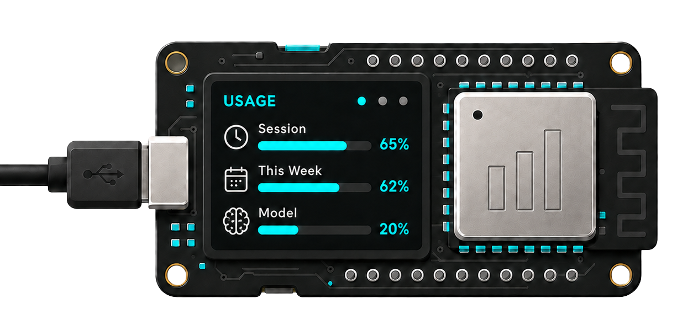

# AI Usage Monitor

<p align="center">
  
</p>

A tiny desk gadget that shows how much of your AI coding quota is left — at a glance, no browser tab required.

If you code with **Claude Code** or **Codex**, you live inside rolling usage windows — a
5-hour limit and a weekly one. **AI Usage Monitor** puts those numbers on a little OLED on
your desk: two live bars, the exact percentage used, and a countdown to when each window
refills. It runs on a **~$6 ESP8266 board with a built-in screen**, sets up in two minutes
over a Wi-Fi captive portal, and shows **either provider at the tap of a button**.

## What you see

```
┌────────────────────────────┐
│ 5H  41%              1h26m │
│ ▓▓▓▓▓▓▓▓▓▓▓░░░░░░░░░░░░░░░ │
│ 7D  15%              5d23h │
│ ▓▓▓▓░░░░░░░░░░░░░░░░░░░░░░ │
│ ────────────────────────── │
│ Claude   -54dBm   12s      │
└────────────────────────────┘
```

The top bar is the **5-hour** window, the second is the **weekly** window, each with the
percent used and a reset countdown. The bottom line shows the active provider, Wi-Fi signal,
and how long ago the data was fetched. Tap the button to flip to the other provider.

## Providers

| Provider | Status | Data source |
|----------|--------|-------------|
| **Claude** (Anthropic) | ✅ supported | `anthropic-ratelimit-unified-5h/7d-*` headers on the Messages API |
| **Codex** (OpenAI) | ✅ supported | `chatgpt.com/backend-api/codex/usage` (5h + weekly windows) |

## Where to next

- **[Installation](INSTALL.md)** — flash a prebuilt build or build from source.
- **[Usage](USAGE.md)** — portal setup, the dashboard, button controls.
- **[Providers](PROVIDERS.md)** — Claude & Codex: credentials, how they work, caveats.
- **[Architecture](ARCHITECTURE.md)** — the Canvas / IBoard / Provider design.
- **[Development](DEVELOPMENT.md)** — build, test, CI/release.
- **[Extending](EXTENDING.md)** — add a board or a provider.
- **[Troubleshooting](TROUBLESHOOTING.md)** — common issues and fixes.

---

MIT © Hudson Brendon · [Source on GitHub](https://github.com/hudsonbrendon/ai-usage-monitor)
